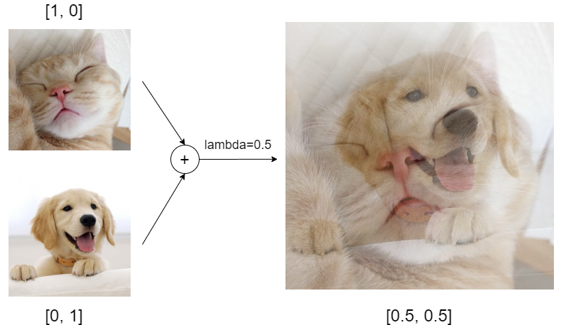
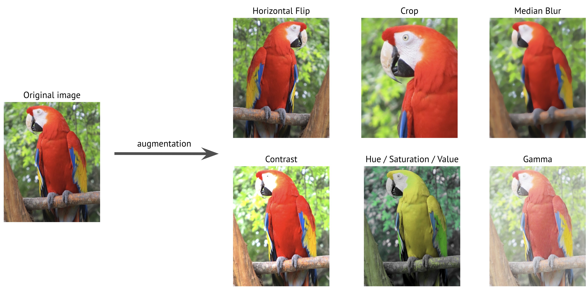

# Data augmentation techniques

> Sources:
>
> <https://www.sciencedirect.com/science/article/pii/S2590005622000911>
>
> <https://en.wikipedia.org/wiki/Data_augmentation>

## Used in YOLOX

### Mixup

Mixup is a data augmentation technique that combines two images and their labels to create a new image and label. The new image is a linear combination of the two original images, and the new label is a linear combination of the two original labels. This technique is used in YOLOX to improve the performance of the model.

Example:

### Mosaic

Mosaic is a data augmentation technique that combines four images and their labels to create a new image and label. The new image is a combination of the four original images, and the new label is a combination of the four original labels. This technique also is used in YOLOX.

### HSV (probably in YOLOX)

HSV stands for Hue, Saturation, and Value. It is a color space that represents colors in terms of their hue, saturation, and value. This technique can be used to alter image quality, brightness, and contrast, therefore creating new images for training.

Example:

## Geometry-based (classic)

### Rotation, flipping, cropping, translation

## Pixel-based (classic)

### Brightness, contrast, saturation, hue

### Noise, salt and pepper noise, speckle noise

Noise:

Blur (gaussian):

Also see radial blur, motion blur, etc.

About convolutions: <https://medium.com/@bdhuma/6-basic-things-to-know-about-convolution-daef5e1bc411>
