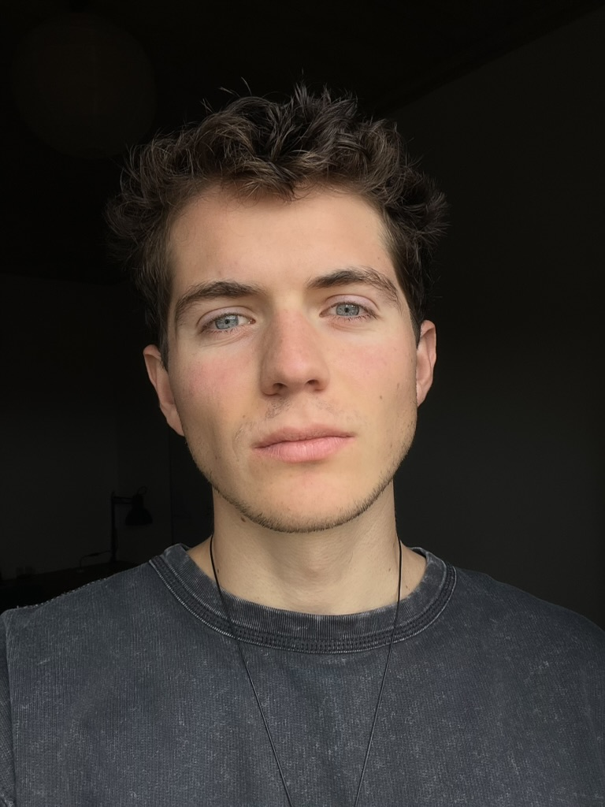

# Benoit Boidin

    
    

        <!--  -->
        
        
    

> Je suis Benoît, un jeune **freelance français** passionné par l'entraînement de **modèles de machine learning** !  
> Ce site présente mon parcours et mes expériences professionnelles.

## Académique

- [**Master** Informatique](/education/#master-en-informatique) : mon Master m'a apporté les bases du génie logiciel, et surtout les techniques d'apprentissage automatique. J'ai également été initié au traitement des données, notamment pour l'image et le son.  
- [**Licence** de Statistiques](/education/#licence-de-statistiques-appliquées) : lors de ma Licence, j'ai appris les statistiques avancées et les sciences cognitives, qui m'ont notamment permis de maîtriser la rigueur de l'expérimentation scientifique.

*Pour télécharger mon CV, cliquez sur [la version française](/documents/cv_fr.pdf) ou [la version anglaise](/documents/cv_en.pdf).*

## Professionnel

- [Reconnaissance de navires](/experiences/ml_boat) : mon stage de fin d'études a consisté en la création d'un pipeline de computer vision pour la reconnaissance de navires en temps réel.
- [MonProjetSup](/experiences/monprojetsup) : pendant mon master, j'ai eu la chance de collaborer avec le LaBRI (Laboratoire Bordelais de Recherche en Informatique), où j'ai travaillé sur la création d'un moteur de recherche utilisant les techniques de NLP et de data extraction.
- [Analyse de PertInInt](/experiences/pertinint) : stage qui consistait à l'analyse d'un framework de détection du cancer du sein par ADN et recherche d'amélioration.

*Je serais heureux de connecter sur [LinkedIn](https://fr.linkedin.com/in/benoît-boidin-276124a3) ou [GitHub](https://github.com/benoitboidin).  
Pour collaborer, j'utilise [Malt](<https://www.malt.fr/profile/benoitboidin>).*

## Divers

Quelques [posts](/posts/posts) que j'ai publié sur LinkedIn.  

Les recommandations de mes anciens superviseurs et collègues : [lettre par Hugo Gimbert](/documents/recommandation_hugo.pdf) (enseignant chercheur au CNRS) et [lettre par Fabien Rhodes](/documents/recommandation_fabien.pdf) (directeur des opérations chez MaxSea).

<!--  

 -->
