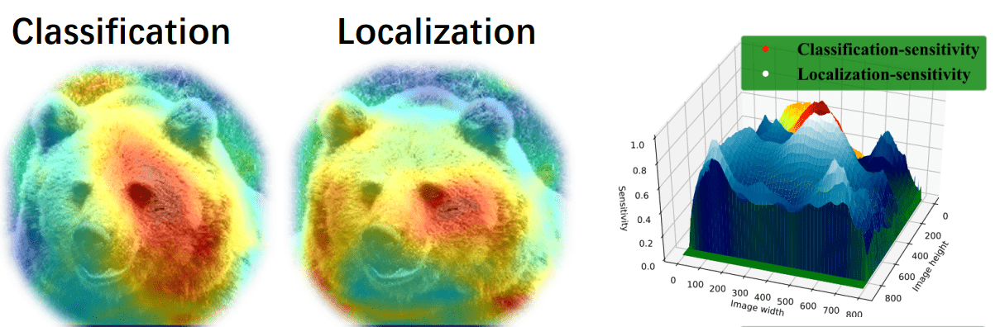
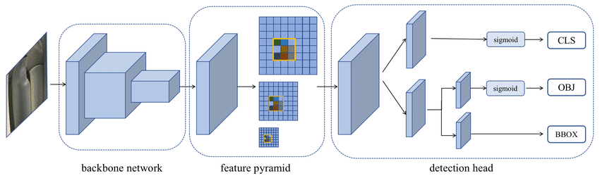
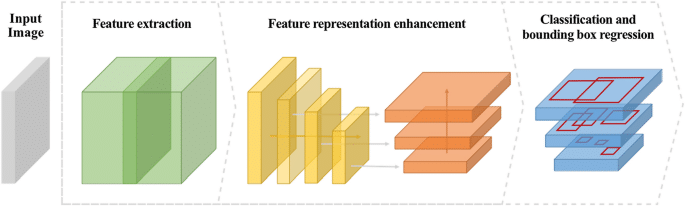
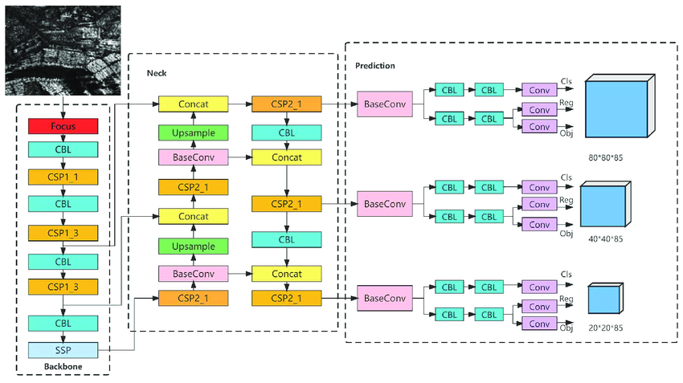

# YOLOX

## Structure

YOLO networks are composed of three parts: backbone, neck, and head. The backbone extracts features from the input image, the neck restores spatial information, and the head predicts the bounding boxes and class probabilities.

The YOLOX network introduce a new decoupled head. Indeed, earlier version of YOLO networks predict the bounding boxes and class probabilities in a single step. The decoupled head predicts the bounding boxes and class probabilities in two separate steps. This allows the network to predict the bounding boxes and class probabilities more accurately.



YOLOX structure differs betwen models (YOLOX-S, YOLOX-M, YOLOX-L, YOLOX-X...). Main structure is showned below:



<!--


-->

CBL (Convolutional Block Layer): extract features from the input image.

Sources:

- <https://www.researchgate.net/figure/Schematic-of-3DSFCNN-CBL-ABL-and-RBL-are-represented-from-top-to-bottom-respectively_fig3_340557387>
- <https://deci.ai/model-zoo/yolox/>
- <https://learnopencv.com/yolox-object-detector-paper-explanation-and-custom-training/#Strong-Data-Augmentation-in-YOLOX>

## Models formats

Models are available in different formats:

- onnx (open neural network exchange), for deployment
- pth, for training (serialized PyTorch  state dictionnary, can be resumed)

To use YOLOX demo, you need the .pth model file.

## Data augmentation

Data augmentation in YOLOX:

- mosaic
- mixup
- HSV?

YOLOX authors say that they don't need to use ImageNet pre-training anymore after applying these augmentation methods.

Code seem to augment data with HSV channel (`data_augment.py`).

Source :YOLOX `data_augment.py` script, <https://aicurious.io/blog/2021-07-28-yolox>

## Training on custom dataset

YOLOX currently support COCO format and VOC format.

<https://yolox.readthedocs.io/en/latest/train_custom_data.html>

"Except special cases, we always recommend to use our COCO pretrained weights for initializing the model."

"As YOLOX is an anchor-free detector with only several hyper-parameters, most of the time good results can be obtained with no changes to the models or training settings. We thus always recommend you first train with all default training settings."

1. In order to train the model, the dataset must have the following structure (even if the dataset has nothing to do with 2017):

```text
dataset/
├── annotations/
│   ├── instances_train2017.json
│   ├── instances_test2017.json
│   └── instances_val2017.json
├── train2017/
├── test2017/
└── val2017/
```

2. Then you must modify (or create a copy) of the `yolox/exps/examples/custom/yolox_s.py` (or other model) file to match the dataset structure and set hyperparameters. Automatically set the dimensions parameters: 

```python
# Error with float conversion to int?
# self.input_size = int(((max_height-min_height)/2+min_height)//32*32, ((max_width-min_width)/2+min_width)//32*32)
# self.test_size = int(((max_height-min_height)/2+min_height)//32*32, ((max_width-min_width)/2+min_width)//32*32)
# self.random_size = int(((max_height-min_height)/2+min_height)//32, ((max_width-min_width)/2+min_width)//32)
```

3. Finally, run the following command:

```bash
python tools/train.py -f exps/example/custom/yolox_s.py -d 1 -b 4 --fp16 -o -c ../trained_models/yolox_s.pth
```

### Preprocessing dataset

There are two ways to train YOLOX on a custom dataset:

- multi-scale training (slower)
- fixed-size training

Hyper-parameters are specified here: <https://github.com/Megvii-BaseDetection/YOLOX/blob/main/docs/manipulate_training_image_size.md>

About multiscaling: <https://mmyolo.readthedocs.io/en/latest/recommended_topics/training_testing_tricks.html>

To summarize, it is not mandatory to resize images to a fixed size before training. YOLOX can handle images of different sizes.

### Evaluation

```
Average Precision (AP):  
    AP% AP at IoU=.50:.05:.95 (primary challenge metric)     
    APIoU=.50% AP at IoU=.50 (PASCAL VOC metric)   
    APIoU=.75% AP at IoU=.75 (strict metric) 

AP Across Scales:  
    APsmall% AP for small objects: area < 322   
    APmedium% AP for medium objects: 322 < area < 962   
    APlarge% AP for large objects: area > 962  

Average Recall (AR):  
    ARmax=1% AR given 1 detection per image   
    ARmax=10% AR given 10 detections per image   
    ARmax=100% AR given 100 detections per image  

AR Across Scales:  
    ARsmall % AR for small objects: area < 322 
    ARmedium% AR for medium objects: 322 < area < 962 
    ARlarge% AR for large objects: area > 962  
```

In COCO, there are more small objects than large objects.  
Specifically: approximately 41% of objects are small (area < 322), 34% are medium (322 < area < 962), and 24% are large (area > 962).  
Area is measured as the number of pixels in the segmentation mask.
